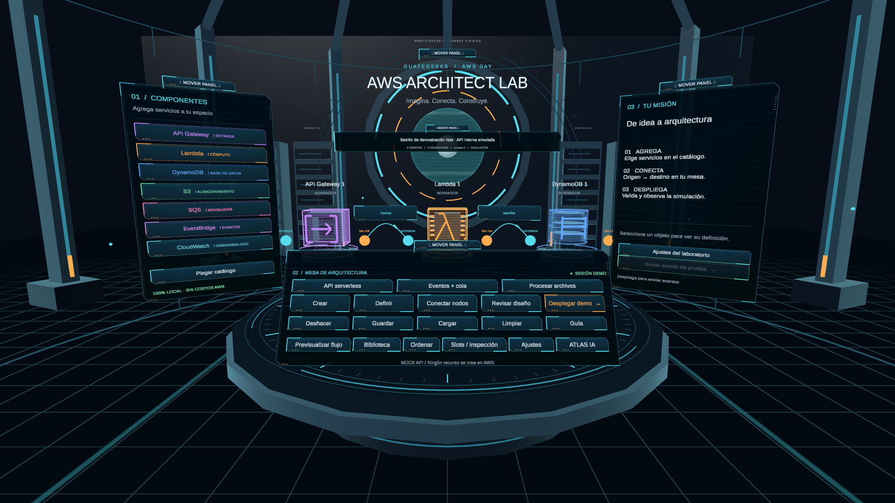

# GuateGeeks · AWS Architect Lab

**0.13.0 — Reviewed workflows, diagnostics and Lambda code:** stage architecture/layout plans with one undo, monitor current event evidence automatically, and draft/edit/validate/test Python Lambda code. Active code publication and version restoration require a manual review button and matching AWS revision. See [controls, constraints and validation](Documentation/Experience-0.13.0.md).

**0.12.1 — Voice destination fix:** “muévelo aquí” now uses the visible tabletop, with an AQUÍ marker and brief retention during speech processing. Downward rays from normal hand/controller height and floating menu buttons no longer prevent destination detection. See [0.12.1 details](Documentation/Experience-0.12.1.md).

**0.12.0 — Spatial voice and compact ATLAS:** point at components or table space while speaking, move and resize individual visuals, undo complete voice edits, choose natural/fast turn detection, and see captions, target previews and action feedback in a movable compact display. Activate once for continuous hands-free audio. See [0.12.0 controls and validation](Documentation/Experience-0.12.0.md).

**0.10.1 — Microphone hotfix:** capture now reads recorded PCM directly and sends it on the audio thread, with a visible input-level meter, clean permission-dialog recovery, and server acknowledgment before generating a response. A live synthesized-speech test now verifies transcription through native WebRTC.

**0.10.0 — ATLAS Realtime assistant:** native WebRTC voice and typed requests, graph-aware architecture proposals with apply/discard/undo, and bounded read-only inspection of the last AWS event. The permanent OpenAI key stays in AWS Secrets Manager. Start with **ATLAS → Conectar IA → Hablar** or **Escribir**. See [ATLAS setup, controls and limits](Documentation/Experience-0.10.0.md).

**0.9.0 — Guided missions and correlated inspection:** search, severity filters, JSON formatting, incremental logs and exact event lookup; direct touch, near grabs, left-palm shortcuts and distinct AWS-confirmed link feedback. Guided first use preserves deployment/cleanup confirmations. Versioned releases include source, hashes and validation reports. See [0.9.0 usage and recovery](Documentation/Experience-0.9.0.md).

**0.8.0 — Reactor lab and live inspection:** titanium architecture, animated reactor and ceiling rings, illuminated compute bays, floor sweeps, layered menu frames and individual service volumes. Tracked hands now use a solid articulated glove mesh with palm, fingers, dorsal armor and wrist seal. Logs and DynamoDB items refresh automatically while their reader is visible; no refresh button is required. See [visual and live-reader notes](Documentation/Experience-0.8.0.md).

**0.7.0 — Object inspector, AWS reader and hands:** selection updates a dedicated object panel; logs and items use a separate list/detail reader. AWS, space and controls share one Settings panel. Quest hand tracking supports pinch selection and moving objects/panels. See [interaction guide](Documentation/Experience-0.7.0.md) and [slot cleanup](Documentation/Slots-Inspection-0.6.0.md). Basic Auth remains limited to six characters and configured inside the headset; see [wireless connection](Documentation/Cloud-Integration.md).

A Spanish-language, VR architecture playground with controllers and hand tracking for AWS Day. Built entirely from Unity geometry and world-space UI. Starts with local mock interactions. The app connects to the sibling GuateGeeksAWS2026 backend through HTTPS + Basic Auth, with VR credential entry, opt-in encrypted remembrance/reconnection, explicit AWS confirmation, real deployment status and test events. No Cognito or AWS SDK is embedded. See [cloud setup and deployment](Documentation/Cloud-Integration.md).

## Run the experience

1. Open this project with **Unity 6000.6.3f1** and let Package Manager finish resolving packages.
2. Open **Assets/Scenes/AWSArchitectLab.unity** (or **GuateGeeks → Open AWS Architect Lab**).
3. Press **Play**. The scene builds its holographic workspace at runtime. The original SampleScene is preserved.

The default PC mode works without a headset. For Quest Link / a PC OpenXR headset, stop Play mode and choose **GuateGeeks → PC preview → Enable OpenXR headset**, then start Play again with a working OpenXR runtime. Select **Desktop mode (no headset)** to return to desktop rehearsal.

A Windows rehearsal build is also available at **Builds/GuateGeeksAWSVR.exe**. Keep the entire Builds folder together when copying it to another Windows machine.

## Demo flow

1. Start with **API serverless**, **Eventos + cola**, or **Procesar archivos**.
2. Choose a catalog service, aim at free table space, then confirm placement with trigger or **Confirmar ubicación**. Cancel leaves the graph unchanged. **Crear** reopens a folded catalog.
3. Select a hologram. Choose explicit property values, edit its visible name with the VR keyboard, then **Aplicar cambios** or **Cancelar edición**. **Ayuda / ficha** explains the actual backend behavior and offers a contextual/pinned inspector.
4. Select a **SALIDA** port and an **ENTRADA**, or hold trigger from output to input. **Conectar nodos** retains the object-to-object fallback. Compatible destinations light up; invalid destinations explain the platform restriction.
5. Select a connection label or **Relaciones** to inspect its meaning, highlight endpoints or remove that edge. **Previsualizar flujo** shows a finite, ordered illustration over data edges only. It is explicitly not observed AWS traffic; CloudWatch associations never carry packets.
6. Use **Revisar diseño** to inspect properties, missing links and auxiliary resources. **Desplegar demo** / **Desplegar / retomar AWS** still require a separate confirmation. Pending definition edits must be applied or cancelled first. Moving/arranging objects and undoing layout changes preserve deployment status.
7. **Biblioteca** saves named local snapshots and reconstructs a miniature from their graph. Load and undo preserve the design layout; stored designs contain no credentials or live resource state. The legacy quick **Guardar / Cargar** slot remains available. **Ordenar** distributes objects on the table and can be undone.
8. **Ajustes** opens a single movable panel with **Conexión AWS**, **Espacio**, and **Controles** tabs. **Slots / inspección** opens a separate reader for resources, logs, items and confirmed slot cleanup. All top-level menus retain movable handles and **A + X** recovery.

The model is bounded to 12 objects and 36 links. The editor enforces the current backend's single Lambda destination per API/queue, single S3 notification destination, and S3 → SQS standard-only constraint. HTTP API is the only offered API type. EventBridge does not offer profiles that the compiler ignores. CloudWatch retention explains its effect on associated Lambda logs.

In demo mode deployment results and the legacy test-event response are fabricated. AWS mode still performs explicit creation/resumption and shows actual resource status/event acceptance. No arbitrary updates or automatic deletion of occupied slots are introduced. The new design preview makes no API calls. The 72 Hz target is a setting, not a sustained performance measurement.

## Controls

| Action | Quest controllers | Desktop |
| --- | --- | --- |
| Select a service / button | Point and press trigger | Left click |
| Move a resource | Hold grip near it, or while pointing | Hold left mouse and drag |
| Adjust held resource distance | Thumbstick up/down | Mouse wheel |
| Look around | Move your head | Hold right mouse and move |
| Turn | Thumbstick left/right, 30° snap | Right mouse |
| Explore | Physical movement within your safe area | WASD; Q/E for height |
| Cancel connection / deployment | B or Y | Escape |
| Toggle connection tool | World-space button | Button or C |
| Recenter | **Centrar vista** | Button or R |
| Seated height | **Altura: sentado** | Same button |
| Reduce visual motion | **Animación: NO** freezes decorative motion | Same button |
| Mute interface sounds | **Sonido: NO** | Same button |
| Snap resources when released | **Ajuste: 10 cm** | Same button |
| Move / rotate a menu | Point at **MOVER PANEL**, hold grip, move your hand and rotate your wrist | Drag its handle; hold right mouse while dragging to rotate with the view |
| Bring a held menu closer / farther | Thumbstick up/down | Mouse wheel |
| Restore all menu positions | **Restaurar menús**, or press **A + X** together | Button or **Shift+R** |

Both controllers can select and grab. One resource can only be held by one controller at a time. Tracking loss or focus loss releases held resources. Continuous VR camera motion is avoided; desktop movement is only active when XR is not running. Hand tracking uses Unity XR Hands 1.9.0 and Meta Aim: point, pinch and release over a button to activate it; hold a pinch on an object or panel handle to move it. Open the hand after tracking recovery. Physical headset acceptance is separate from automated pinch tests.

## Movable menus and passthrough (0.2.0)

The catalog, dedicated object inspector, workspace reader, architecture controls, status, title and unified Settings panel have their own grab handles. Settings embeds cloud connection, comfort, help and environment controls rather than creating separate floating panels. Button triggers keep their normal actions. A panel has one grab owner at a time; releasing grip saves its position and orientation locally. Inspector refreshes and architecture presets preserve the moved panels. Focus loss, tracking loss, pause and cancel release a held panel. Use **A + X** to recover the default layout even if the configuration panel is out of view. Node labels stay attached to their resources.

Open **Ajustes → Espacio**, which offers three saved modes:

- **Fondo: laboratorio** restores the virtual room, console and decorative background.
- **Fondo: oculto** hides that environment and keeps a dark background, menus and resources.
- **Passthrough** displays the physical room behind the menus and architecture on Quest. It starts the Meta camera subsystem through AR Foundation and uses a transparent camera background. If initialization fails, the lab returns to its virtual environment. Desktop mode reports that Quest passthrough is unavailable instead of pretending to show a camera feed.

This uses pinned Unity OpenXR Meta **2.4.1**, AR Foundation **6.4.0**, and XR Composition Layers **2.2.0**, alongside the existing OpenXR 1.16.1. Android minimum API is now **32**, as required by the installed Meta camera feature; target remains the installed API 36. The app does not acquire, record or transmit camera images, and sends no camera data to the cloud API. See [Unity passthrough setup](https://docs.unity3d.com/Packages/com.unity.xr.meta-openxr@2.4/manual/features/camera.html). The package supplies the native compositor layer; ARCameraBackground is not needed.

## Holographic design and library decisions

The workspace now uses transparent scanline projections, handcrafted service emblems, segmented orbit rings, a radial console, procedural floor grid, and clipped glass panels. TextMeshPro renders world-space labels. Hover reticles, source/destination hints, a curved connection preview, and traveling event packets make interaction states visible. Interface sounds are synthesized locally. The motion control freezes decorative animation and replaces moving flow capsules with timed stationary markers while simulation progress continues.

| Library / approach | Decision for this demo |
| --- | --- |
| OpenXR + Input System | Keep the project's pinned controller stack and existing grab ownership, tracking-loss handling, and desktop fallback. |
| URP + handcrafted shaders/meshes | Keep. Grid and circuitry use consolidated geometry; hologram shaders supply edge light and scanlines. No bloom or imported VFX assets are required. |
| uGUI + TextMeshPro | Adopt TMP for distance-readable text; it is already provided by the installed uGUI package. Essential font resources are included in Assets. [Unity TMP documentation](https://docs.unity3d.com/Packages/com.unity.textmeshpro@3.0/manual/index.html). |
| XR Interaction Toolkit 3.3 | Not installed. Hand tracking uses XR Hands + Meta Aim with the existing targets and ownership rules. Consider XRI if the product expands into additional interaction modes. Its Near-Far Interactor supports near/far interaction and uGUI; migrating should replace the existing interaction stack and preserve the demo's grab-distance controls. [Near-Far Interactor documentation](https://docs.unity3d.com/Packages/com.unity.xr.interaction.toolkit@3.3/manual/near-far-interactor.html). |
| GraphView / editor graph libraries | Keep the custom serializable runtime graph for the spatial designer. Unity's experimental GraphView belongs to UnityEditor and does not supply a deployed 3D VR graph UI. [GraphView API](https://docs.unity3d.com/ru/2019.4/ScriptReference/Experimental.GraphView.GraphView.html). |
| Third-party tween, node editor, or VFX packages | No additional dependency is needed for this bounded seven-service demo. Native meshes, LineRenderer, uGUI, and C# own the visual and interaction behavior. |

This is an implementation recommendation, not an on-device performance result. Unity advises avoiding expensive post-processing on untethered XR; the design follows that direction, but transparent overdraw and stereo frame timing still need Quest profiling. [Unity untethered XR optimization](https://docs.unity3d.com/6000.0/Documentation/Manual/xr-untethered-device-optimization.html).

## Meta Quest 3: preparar, compilar e instalar

El menú **GuateGeeks → Meta Quest 3** contiene **Prepare project**, **Check readiness** y **Build demo APK**. El proyecto usa `com.guategeeks.awsarchitectlab`, IL2CPP/ARM64, Vulkan, OpenXR al iniciar, estéreo single-pass y el perfil Touch Plus. El destino del manifest es Quest 3 (`eureka`). El perfil gráfico Mobile usa MSAA 4x, escala 1, sin HDR, sombras ni copias de profundidad/color. La experiencia inicia en modo simulado; la versión 0.3.0 conserva el permiso de Internet para conectar explícitamente con la API real.

1. En Unity Hub, agrega **Android Build Support**, **Android SDK & NDK Tools** y **OpenJDK** a **6000.6.3f1**. Reinicia el editor tras instalar los módulos.
2. Ejecuta **Prepare project** y consulta `Validation/quest3-preflight.txt`. El target SDK es el mayor instalado; la comprobación exige API 34 o superior, según el requisito de Meta para aplicaciones nuevas desde marzo de 2026. [Requisito Android de Meta](https://developers.meta.com/horizon/blog/meta-quest-apps-android-14-march-1/).
3. Ejecuta **Build demo APK**. Cambia a Android, espera la recompilación y genera **Builds/Quest3/GuateGeeksAWSVR-Quest3.apk**. El resultado se registra en `Validation/quest3-build.txt`. Es un APK para instalación local con la firma de desarrollo de Unity, no una publicación en Meta Horizon Store.
4. Activa el modo desarrollador del visor desde tu cuenta de Meta, conecta un cable USB de datos y acepta dentro del visor la autorización de depuración USB. Ejecuta desde PowerShell `./Tools/Install-Quest3.ps1`. Si hay varios dispositivos, usa `-Serial`. El script verifica que sea un Quest 3, instala mediante `adb install -r` y abre la demo; no desinstala la app ni borra su diseño guardado.
5. En el visor, valida ambos controles, selección por gatillo, agarre por grip, giro de 30°, altura sentado, pérdida/recuperación de tracking, pausa al quitarse el visor, legibilidad y despliegue/eventos simulados. Mide tiempos CPU/GPU y comodidad en el dispositivo antes de la demo. `Application.targetFrameRate = 72` no demuestra que OpenXR haya elegido 72 Hz ni que se mantenga esa frecuencia.

Para automatizar en el editor abierto, escribe `quest-setup`, `quest-check` o `build-quest` en `Validation/editor-command.txt`. Con el editor cerrado, se puede compilar por CLI usando `-batchmode -quit -buildTarget Android -projectPath <proyecto> -executeMethod GuateGeeks.AwsVr.Editor.QuestBuild.BuildApk -logFile <log>`.

La validación de configuración no sustituye una compilación Android ni una prueba física. La configuración del manifest se genera mediante [Meta Quest Support de OpenXR](https://developers.meta.com/horizon/documentation/unity/unity-openxr-settings-quest/); no se mantiene un manifest manual que pueda entrar en conflicto con Unity.

## Quest build: detalles del entorno

OpenXR 1.16.1 is pinned in `Packages/manifest.json`. The saved project enables the Android OpenXR loader, Meta Quest Support, Oculus Touch and Touch Plus controller profiles, Meta camera/session and composition-layer features, single-pass rendering, Vulkan, ARM64, IL2CPP, and Android API 32 minimum. Desktop XR initialization is off by default.

Esta estación tiene **Android Build Support**, SDK/NDK y OpenJDK instalados para Unity 6000.6.3f1. Tras instalar módulos, es necesario reiniciar el editor: una sesión anterior puede devolver un informe de compilación exitoso aunque falle el empaquetado. El helper verifica también cero errores, destino Android y existencia del APK. Para regenerarlo:

1. Run **GuateGeeks → Configure lab and Quest** if settings need regeneration (this also restores desktop preview defaults).
2. Switch the build profile to Android; ensure AWSArchitectLab is the first enabled scene.
3. Check **Project Settings → XR Plug-in Management → Project Validation** and resolve device/toolchain-specific requirements.
4. Build and run on the Quest. Validate controller aim, tracking origin, seated height, readability, and frame timing on-device before the live event.

The implementation uses Unity's OpenXR [Meta Quest support](https://docs.unity3d.com/Packages/com.unity.xr.openxr@1.16/manual/features/metaquest.html) and controller input. Build evidence is recorded in `Validation/quest3-build.txt`; headset performance must be measured separately.

`Assets/GuateGeeks/link.xml` conserva los renderers y colliders utilizados por `GameObject.CreatePrimitive`. La primera prueba IL2CPP en Quest detectó que `CapsuleCollider` había sido eliminado, lo cual detenía la creación del laboratorio. Estas dependencias nativas deben conservarse aunque los objetos se generen por código; véase [CreatePrimitive en Unity](https://docs.unity.com/en-us/engine/6000.0/script-reference/unityengine/gameobject/createprimitive). El mensaje `AWS Architect Lab ready` en logcat confirma que terminó la creación del entorno, interfaz, rig y recursos.

Despliegue verificado el **1 de octubre de 2026**: APK 0.1.0 instalado por USB en Meta Quest 3, firma v2 válida, ARM64, SDK mínimo 29 y target 36, sin permiso de Internet. La compilación final terminó con **0 errores y 8 avisos**. Logcat confirmó la creación completa del laboratorio y ambos perfiles Touch Plus, sin excepciones de Unity en la captura final. El usuario confirmó que ve el laboratorio; `Validation/quest3-headset.png` es una captura estereoscópica real del visor. Meta puede pedir despertar los controles antes de abrir la aplicación. Quedan por evaluar exhaustivamente las interacciones físicas y el rendimiento sostenido; esta prueba de arranque no los certifica.

## Persistence and API boundary

**Guardar / Cargar** stores one JSON architecture in `Application.persistentDataPath/aws-day-architecture.json`. Loaded layouts return to draft. Corrupt files leave the current layout intact. **Deshacer** restores recent edits, including node deletion and preset replacement. There is a 12-resource cap for a readable demo workspace.

`ICloudApi` separates the experience from cloud implementation. `MockCloudApi` provides session connection, deployment events, failures, and invocation responses using local coroutines. `AwsCloudApi` implements the real backend contract with HTTPS/Basic Auth and server-side IAM service roles. Credentials are provisioned at runtime and never embedded. A separate cloud checkpoint saves the URL, slot, stack ID and design for recovery without credentials. See [Cloud-Integration.md](Documentation/Cloud-Integration.md).

Version 0.11.0 adds continuous ATLAS voice, local component/connection/UI actions, and persistent component sizing. See [the voice and sizing guide](Documentation/Experience-0.11.0.md) for controls and validation scope.

## Project map

- `Assets/GuateGeeks/Runtime/Architecture.cs`: service catalog, graph, settings, validation, presets.
- `ArchitectureLab.cs`: experience state, world UI, editing, persistence and deployment; `ArchitectureLab.Cloud.cs` owns mode selection and recovery.
- `AwsCloudApi.cs`, `CloudConnection.cs`: HTTPS transport, backend contract, identity checks and transient session bootstrap.
- `LabRig.cs`: OpenXR input, desktop rehearsal, grab ownership, comfort controls.
- `LabVisuals.cs`, `NodeView.cs`, `LinkView.cs`: primitive geometry, labels, directed animated connections.
- `HoloGeometry.cs`, `HoloEnvironment.cs`, `HoloPanelGraphic.cs`: generated service emblems, console, grid, glass panels.
- `LabFeedback.cs`: synthesized audio and reduced-motion clock.
- `Assets/GuateGeeks/Resources/LabUnlit.shader`, `LabHologram.shader`, `LabGrid.shader`: stereo-compatible URP shaders included through Resources.
- `Assets/GuateGeeks/Editor`: scene/XR setup and fixed validation commands.
- `Assets/GuateGeeks/Tests`: graph/API unit tests and complete play-mode scenarios.

Run the EditMode and PlayMode suites in **Window → General → Test Runner**. Play-mode tests temporarily use and then restore the local saved design. Reports and rendered screenshots are in `Validation/` when run through the editor validation helper.

To run tests in an already-open editor, write `edit-tests` or `play-tests` to `Validation/editor-command.txt`. `setup` regenerates settings and creates the scene if missing; `open` opens the scene only if the current scene has no unsaved changes; `build-desktop` builds the Windows rehearsal player. Import changed scripts before issuing a test command.

Verified locally on September 30, 2026: **14 EditMode tests and 3 PlayMode scenarios passed**. The Windows build succeeded with **0 errors and 2 warnings** (optional OpenXR input-control migration notices). Reports remain separate across editor domain reloads.

Version 0.2.0 on October 1: **5 PlayMode scenarios passed**, including saved menu translation/rotation, single-owner grabs, layout reset, inspector-handle preservation, environment visibility and desktop passthrough fallback. The user confirmed real-room passthrough and menu movement on Quest 3. The final APK includes subsequent handle-placement refinements; see `Validation/quest3-menus-passthrough.txt` for the build and deployment record. The Windows executable predates this update; use the Unity Editor for the current desktop rehearsal.

Version 0.3.0 on October 1: **27 EditMode tests and 8 PlayMode scenarios passed**. Cloud tests use response fixtures generated by the actual Lambda routes with AWS clients mocked. They cover create/poll/invoke, ambiguous responses, identity conflicts, rollback, authentication, credential expiry, explicit confirmation, recovery, provider switching and stopping a stalled connection. Backend tests pass **39 cases** and CloudFormation lint passes all 11 template scenarios. No live backend was deployed for this integration; see [the operator guide](Documentation/Cloud-Integration.md) and `Validation/cloud-integration.txt` for build evidence and remaining live checks.

Later on October 1, the requested backend was deployed successfully and the Quest connected to **AWS · SLOT 1**, confirmed by the user and successful API requests. Temporary USB credential files were consumed/deleted. See [the active deployment record](../GuateGeeksAWS2026/deployment/current-backend.md). Creating a workload architecture from VR remains the next live test.

Validation covers catalog selection, configuration, connection, grab ownership, removal, undo, save/load, deployment success, editing locks, test events, failure/retry, cancellation, clear/reset, and malformed save recovery. Holographic interaction checks cover panel renderers, TMP fonts and unclipped starting labels, connection hints and non-mutating previews, preview cancellation/reset/focus loss, 10 cm snapping, reduced motion, and mute controls. Screenshots are rendered by Unity, not design mockups.

The Windows player was also exercised through its visible controls: event-driven preset, Lambda memory adjustment, deployment review, successful mock deployment, and a test event returning fabricated telemetry. The Android build, USB installation, controller profile activation and visible headset startup were subsequently verified as described above. Full physical interaction, comfort and sustained performance still require a longer Quest session. See `Validation/EditMode-results.xml`, `Validation/PlayMode-results.xml`, `Validation/desktop-build.txt` and `Validation/quest3-deployment.txt` for completed checks.
