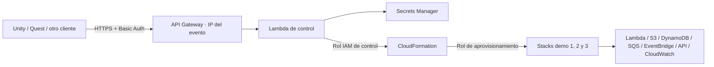

# GuateGeeks AWS Day 2026 · backend de la experiencia VR

**0.13.0:** ATLAS ahora incluye planes agrupados, diagnóstico vivo y borradores Python para Lambda. El backend añade validación, pruebas en una función separada con permisos limitados, publicación con revisión de versión y restauración de código. Consulta [el contrato y sus límites](docs/code-authoring.md). La IA no confirma publicaciones; el botón del editor conserva esa decisión.

Backend implementado para recibir el JSON del proyecto vecino `GuateGeeksAWSVR`, validar un grafo de servicios y crear infraestructura real. Incluye una Lambda de control, API Gateway REST con HTTPS + Basic Auth, Secrets Manager, roles IAM, compilador de CloudFormation, ejemplos y herramientas de despliegue, prueba y limpieza. No utiliza Cognito, servidores permanentes ni una base de datos de control.

**Estado:** backend probado desde WSL con infraestructura temporal real en AWS: los tres presets y una arquitectura con los siete servicios. Consulta los resultados y límites en [el informe de validación](docs/validation.md). Unity 0.3.0 incluye el adaptador HTTP `AwsCloudApi`, selección explícita demo/AWS, autenticación dentro de VR en 0.4.0 (USB sólo en 0.3), validación, polling y eventos según [la guía de integración](docs/unity-integration.md). Las respuestas de creación/estado incluyen `graphHash` para verificar la identidad del diseño en slots compartidos. La conexión real de Quest con el backend desplegado fue confirmada: **AWS · SLOT 1**. La arquitectura creada posteriormente en slot 1 fue inspeccionada y eliminada; los tres slots quedaron vacíos.

Los recursos temporales de las pruebas anteriores se eliminaron. El **1 de octubre de 2026** se desplegó el backend solicitado: stack `guategeeks-aws2026` en `us-east-1`. La autenticación, catálogo y validación de los tres presets pasaron comprobaciones reales; los tres slots están libres. Consulta [el backend activo y cómo conectar Quest](deployment/current-backend.md). Este backend permanece desplegado hasta su limpieza explícita.

**Actualización 0.4.0:** el backend genera una contraseña Basic aleatoria de exactamente seis caracteres y rechaza contraseñas vacías o mayores de seis. La actualización rota la credencial anterior. Unity permite configurarla dentro del visor, recordarla cifrada y reconectar por Wi-Fi; el script USB es legado.

## Contexto del evento para ATLAS

El contexto de cada sesión nueva de ATLAS incluye los datos de [AWS Community Day Guatemala 2026](https://awscommunitygt.com/), verificados el 5 de octubre de 2026: **sábado 10 de octubre de 2026, desde las 8:00 a. m. (hora de Guatemala), en la Universidad Rafael Landívar, Zona 16, Ciudad de Guatemala**. El evento reúne a la comunidad AWS con charlas técnicas, casos de uso y networking; el registro es gratuito en el sitio oficial.

Según el responsable del proyecto, **GuateGeeks lleva esta experiencia al AWS Community Day Guatemala 2026**: GuateGeeks AWS Architect Lab con ATLAS, un laboratorio inmersivo para explorar arquitectura AWS en Meta Quest. Los participantes crean y conectan hologramas de servicios, inspeccionan sus relaciones y reciben explicaciones y ayuda por voz de ATLAS. El laboratorio ofrece simulación local y operaciones reales en AWS con revisión y confirmación explícitas. ATLAS acredita a GuateGeeks al explicar quién trae la experiencia y qué se presenta, sin atribuirle la organización completa del evento ni afiliaciones no confirmadas.

Las 8:00 a. m. corresponden al inicio del evento; no hay horario, salón, ponente ni título confirmados para la demostración. ATLAS remite al sitio oficial para esos detalles y responde con la fecha absoluta, sin asumir que el evento ocurre hoy.

Los datos viven en `src/assistant.py`, junto al contexto de la sesión; los ejemplos de integración del grafo siguen llegando mediante `get_context`. Para activar esta actualización se requiere publicar el backend y reconectar ATLAS; no requiere cambiar el APK. Actualiza este contexto si la organización cambia fecha o sede.

## Arquitectura



La cuenta de servicio del cliente es `quest-demo`, con contraseña aleatoria de 40 caracteres guardada en Secrets Manager. AWS recibe llamadas autenticadas mediante credenciales temporales de roles IAM; no se crean usuarios IAM ni access keys para el visor. La API admite una cuenta de servicio compartida en esta versión: todos los clientes autorizados comparten los tres slots.

El endpoint de control es regional y acepta conexiones autenticadas desde cualquier IP. No utiliza lista de IP permitidas en API Gateway ni una comprobación de origen en Lambda. Los visores pueden usar distintas redes. La Lambda no necesita VPC, VPN ni NAT Gateway.

## Preparación manual de la cuenta nueva

Guía paso a paso con comandos **WSL / Bash**: [AWS-SETUP-COMMANDS.md](AWS-SETUP-COMMANDS.md).

1. Activa MFA en la cuenta raíz y configura contactos de facturación. Usa una identidad administrativa temporal para preparar el entorno; evita operar diariamente con root.
2. Configura un perfil AWS CLI mediante IAM Identity Center/SSO o credenciales temporales de tu organización. Comprueba `aws sts get-caller-identity --profile awsday --region us-east-1`. No guardes credenciales AWS en Unity ni en este repositorio.
3. Instala AWS CLI v2, AWS SAM CLI y Python 3.13. Alternativa para compilar: Docker y `-UseContainer`; Python 3.12 también sirve para estas pruebas locales.
4. Confirma cuenta, región (`us-east-1` por defecto) e IP pública de salida del evento. Comprueba cuotas de Lambda/API Gateway si la cuenta acaba de abrirse; no se reserva concurrencia para evitar el mínimo de concurrencia no reservada de cuentas nuevas.
5. La identidad que ejecute SAM necesita crear los recursos de `template.json`, roles/políticas IAM, artefactos S3 y stacks CloudFormation, además de pasar roles. Si usas `BudgetEmail`, necesita permisos de AWS Budgets. Estos son permisos del operador de bootstrap, separados de los roles restringidos de ejecución.

## Desplegar

Desde esta carpeta, en PowerShell:

```powershell
python -m venv .venv
.\.venv\Scripts\python.exe -m pip install -r requirements-dev.txt
.\.venv\Scripts\python.exe -m unittest discover -s tests -v
.\.venv\Scripts\cfn-lint.exe template.json

.\tools\Deploy.ps1 -Profile awsday -Region us-east-1 -BudgetEmail '<TU-CORREO>' -UseContainer
```

El script comprueba la identidad, valida SAM, compila y despliega el control plane. Los parámetros entre `<...>` deben reemplazarse. Omite `-UseContainer` si Python 3.13 está disponible para SAM. `BudgetEmail` es opcional; al establecerlo se crea un presupuesto mensual para toda la cuenta, con alerta al 80% del importe configurable `MonthlyBudgetUsd` (10 por defecto). **Ese importe es un umbral de aviso elegido para la demo, no una estimación ni un límite de gasto.**

Las salidas del stack incluyen `ApiUrl`, `AuthSecretArn` y los roles. Recupera la contraseña desde Secrets Manager con una identidad autorizada y entrégala al cliente por el mecanismo de configuración de la demo. No la incluyas en escenas, APK, código, capturas ni commits. `tools/demo.py` la consulta en memoria para hacer las pruebas sin imprimirla.

No cambies `DemoPrefix` después de crear demos. Usa un prefijo distinto si instalas otro control plane en la misma cuenta/región. SAM crea un bucket de artefactos compartido administrado por SAM; no pertenece a los slots.

## Prueba de extremo a extremo

Ejecuta desde la IP permitida; estos comandos crean recursos reales:

```powershell
.\.venv\Scripts\python.exe tools/demo.py session --profile awsday
.\.venv\Scripts\python.exe tools/demo.py smoke --profile awsday --slot 1 --architecture examples/api-serverless.json
.\.venv\Scripts\python.exe tools/demo.py smoke --profile awsday --slot 2 --architecture examples/eventos-cola.json
.\.venv\Scripts\python.exe tools/demo.py smoke --profile awsday --slot 3 --architecture examples/procesar-archivos.json
```

El comando `smoke` valida, crea el stack, consulta su estado hasta terminar y envía un evento real por el primer nodo. En el preset HTTP, el backend firma la petición a `POST /demo` con SigV4. Los otros presets devuelven aceptación asíncrona: revisa los logs de las Lambdas y los ítems de las tablas para comprobar procesamiento. No se fabrican latencias ni métricas.

Las funciones de demo incluyen código fijo que escribe un ítem DynamoDB, objeto S3, mensaje SQS o evento EventBridge por cada destino conectado. No se permite subir código, plantillas, nombres físicos, ARNs ni políticas IAM desde el cliente. Las conexiones SQS→Lambda crean un event source mapping; S3→Lambda/SQS crean notificaciones y permisos; EventBridge→Lambda/SQS crea reglas y permisos. Los logs de cada Lambda se crean explícitamente con retención.

## API y semántica de despliegue

Contrato: [OpenAPI](docs/openapi.yaml). Todos los endpoints requieren Basic Auth; las peticiones rechazadas por IP se detienen en API Gateway.

| Método y ruta | Resultado |
|---|---|
| `GET /v1/session` | Autenticación, región y versión del esquema |
| `GET /v1/catalog` | Servicios, límites y restricciones |
| `POST /v1/architectures/validate` | Valida directamente el JSON de arquitectura; no crea recursos |
| `POST /v1/deployments` | Recibe `{deploymentId:"1", architecture:{...}}`; responde 202 |
| `GET /v1/deployments/1` | Estado CloudFormation y nodos identificados por su ID original |
| `POST /v1/deployments/1/events` | Recibe `{resourceId:"node0"}` y envía un evento fijo |
| `DELETE /v1/deployments/1?purge=true` | Vacía versiones S3 y solicita eliminación del stack |

Tres slots (`1`, `2`, `3`) limitan stacks activos por control plane. Repetir POST con el mismo diseño/slot devuelve el estado existente; otra arquitectura devuelve 409. Tras un timeout, consulta ese mismo slot antes de reintentar. Los despliegues son inmutables: elimina, espera al 404 y vuelve a crear para cambiar el diseño. `position` y `state` no afectan al hash; nombres y configuraciones sí. Un stack en rollback se muestra como fallo, aunque tenga recursos individuales en `CREATE_COMPLETE`.

Consulta cada 3 segundos y aplica backoff con jitter ante 429/errores transitorios. Los 400 indican validación, 401 autenticación, 403 IP/permisos de API Gateway, 409 conflicto y 502 fallo de operación AWS. La respuesta 502 incluye `requestId` para buscar el error en CloudWatch. Los logs no almacenan cabeceras ni contraseñas.

## Catálogo compatible con Unity

| kind | Servicio | setting |
|---|---|---|
| 0 | API Gateway | 0 HTTP API. REST API del catálogo visual se rechaza explícitamente |
| 1 | Lambda | 0/1/2/3 → 128/256/512/1024 MB; timeout fijo de 10 s |
| 2 | DynamoDB | 0 bajo demanda; 1 aprovisionada a 1 RCU y 1 WCU; clave `id` String |
| 3 | S3 | 0 versionado activado; 1 suspendido; privado, cifrado, expiración 1 día |
| 4 | SQS | 0 estándar; 1 FIFO con deduplicación por contenido |
| 5 | EventBridge | 0/1 crean buses propios; no se usa el bus predeterminado |
| 6 | CloudWatch | 0/1/2 → retención Lambda de 7/14/30 días y dashboard real |

Máximo 12 nodos, 36 enlaces y 64 KiB por solicitud. Se rechazan ciclos, duplicados, referencias inexistentes y nodos aislados. API/cola tienen como máximo una Lambda consumidora; S3 tiene un único destino de notificación, y S3→SQS FIFO no se admite. Las métricas S3 de almacenamiento son diarias; los paneles no garantizan actualización inmediata. Los enlaces a CloudWatch configuran métricas y retención, no transporte de eventos. La región del grafo debe coincidir con la del backend.

Las HTTP APIs **generadas dentro de los diseños** usan `AWS_IAM`, y el backend firma los eventos de prueba. Esto es independiente del Basic Auth de la API de control. No se exponen endpoints de demo con invocación anónima.

## Limpieza y operación

Detén el envío de eventos y espera a que se vacíen las colas antes de borrar. El script siguiente elimina datos de los buckets de ese slot, incluidas versiones y delete markers:

```powershell
.\.venv\Scripts\python.exe tools/demo.py delete --profile awsday --slot 1
.\.venv\Scripts\python.exe tools/demo.py delete --profile awsday --slot 2
.\.venv\Scripts\python.exe tools/demo.py delete --profile awsday --slot 3
sam delete --stack-name guategeeks-aws2026 --profile awsday --region us-east-1
```

**Borra primero los tres slots y después el control plane**, porque los stacks de demo dependen de sus roles. Un bucket puede recibir objetos de trabajo en vuelo durante la limpieza: si CloudFormation termina `DELETE_FAILED`, detén los productores y repite DELETE con `purge=true`. No se fuerza la eliminación de recursos desconocidos. `PURGING` con `retryDelete:true` requiere repetir DELETE; para `DELETE_IN_PROGRESS`, consulta GET hasta 404. El script lo hace automáticamente. Sin `purge=true`, S3 puede bloquear el borrado si contiene datos.

CloudFormation elimina el secreto sin ventana de recuperación al borrar el control plane, según su [política de eliminación predeterminada](https://docs.aws.amazon.com/AWSCloudFormation/latest/TemplateReference/aws-attribute-deletionpolicy.html). El bucket de artefactos SAM puede permanecer; revísalo en la consola antes de dar por terminada la limpieza. No hay TTL para stacks; el operador debe ejecutar la limpieza al finalizar la demo.

Rotación posterior al evento: `./tools/Rotate-Password.ps1 -Profile awsday`. Invalida la contraseña anterior en un máximo de 60 segundos de caché por entorno Lambda. Actualiza los clientes por el mismo canal de configuración. Cambiar de red no requiere redesplegar la API.

La API mantiene una política de recursos sin condiciones de IP y `AlwaysDeploy`. La autenticación, cuotas, roles de sala y permisos AWS continúan aplicándose. El rol de aprovisionamiento incluye `apigateway:TagResource` y `apigateway:UntagResource`, necesarios para crear los recursos HTTP API etiquetados por CloudFormation.

CloudWatch incluye alarmas para errores de Lambda y 5xx de la API, visibles en consola; no tienen suscriptores SNS. Secrets Manager, API Gateway, logs, dashboards y recursos de demo pueden generar cargos, incluso con poca actividad. Los límites de nodos/slots reducen alcance, pero no constituyen un límite de gasto o de concurrencia. No se presupone cobertura por Free Tier.

## Alcance de permisos y límites de esta demo

Los roles de ejecución restringen los recursos por prefijo de demo y el acceso `iam:PassRole` a roles concretos. El rol de CloudFormation no puede crear identidades IAM. Las funciones demo comparten un rol con acceso al espacio de recursos de los tres slots: es una demo de confianza única, **no aislamiento multiusuario**.

La API Gateway de los diseños asigna IDs al crear APIs; por ello el rol de CloudFormation permite administrar HTTP APIs (`/apis/*`) de la región. También hay permisos de event source mappings Lambda con recurso `*`, y `logs:DescribeLogGroups` con `*`. Estos permisos tienen un alcance mayor que los nombres de demo: despliega en la cuenta dedicada al evento. El compilador cerrado impide que los clientes elijan recursos externos, pero no elimina el riesgo de comprometer la Lambda de control. El ARN de invocación HTTP también admite APIs de la cuenta/región con la ruta exacta `POST /demo`.

Los recursos workload usan boto3 incluido en el runtime Lambda; la Lambda de control empaqueta la versión declarada en `src/requirements.txt`. La demo usa entrega al menos una vez: el código reutiliza IDs para escrituras idempotentes básicas, pero no garantiza exactamente una vez ni procesamiento productivo con DLQ/reconciliación. No hay edición de stacks, ejecución de código arbitrario, rollback interactivo, credenciales por visor ni interfaz administrativa web.

## Archivos y verificación

Resultado local en WSL: **35 pruebas aprobadas y 11 plantillas sin hallazgos de cfn-lint**, con SAM build en Python 3.13. Consulta el [informe de validación y sus límites](docs/validation.md).

- `src/app.py`: autenticación y rutas; `src/graph.py`: validación; `src/compiler.py`: plantillas; `src/workload.py`: código fijo de demo.
- `tools/build_template.py`: fuente del control plane; genera `template.json` con `python tools/build_template.py`. Modifica el generador y regenera la plantilla juntos.
- `examples/*.json`: los tres presets de Unity; `tools/demo.py`: smoke y limpieza con una identidad AWS local.
- `tests/test_backend.py`: validación de grafos, conexiones, autenticación, reintentos, errores y borrado versionado. `tools/validate_templates.py` valida presets y combinaciones adicionales con cfn-lint.
- `tools/live_test.py`: pruebas AWS aisladas, con cuenta explícita, prefijo aleatorio, bucket de artefactos propios y fases `prepare`, `exercise`, `matrix`, `network`, `rotation` y `cleanup`. Crea recursos reales; sus resultados y estado se guardan en `test-results/`. Ejecuta siempre `cleanup` al terminar, incluso si una prueba falla. `diagnostics` consulta eventos y logs; `cleanup-demos` limpia solo los slots para reintentar tras una corrección.

## Decisiones verificadas en documentación AWS

- [Roles de servicio CloudFormation](https://docs.aws.amazon.com/AWSCloudFormation/latest/UserGuide/using-iam-servicerole.html) y [PassRole](https://docs.aws.amazon.com/IAM/latest/UserGuide/id_roles_use_passrole.html): separación entre operador, control plane, aprovisionamiento y ejecución.
- [Políticas de recursos de API Gateway](https://docs.aws.amazon.com/apigateway/latest/developerguide/apigateway-resource-policies-examples.html): restricción de origen en el endpoint de control.
- [Runtimes Lambda](https://docs.aws.amazon.com/lambda/latest/dg/lambda-runtimes.html): Python 3.13; [SAM HTTP API](https://docs.aws.amazon.com/serverless-application-model/latest/developerguide/sam-resource-httpapi.html): integración Lambda.

Contexto de diseño: conversación «Diseña experiencia VR AWS» (30 de septiembre–1 de octubre de 2026) y contrato real de `GuateGeeksAWSVR/Assets/GuateGeeks/Runtime/Architecture.cs`. La conversación de referencia aún no contenía el informe final de investigación; las decisiones implementadas aquí se especifican explícitamente.
